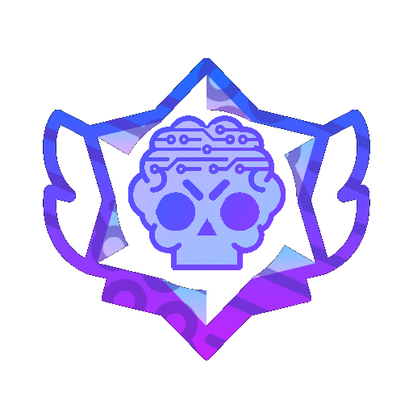
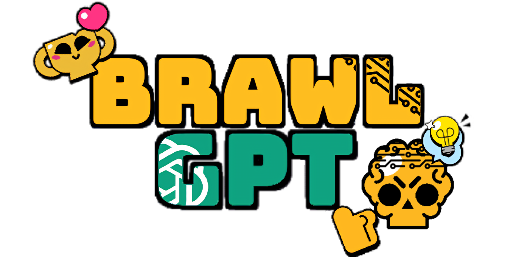
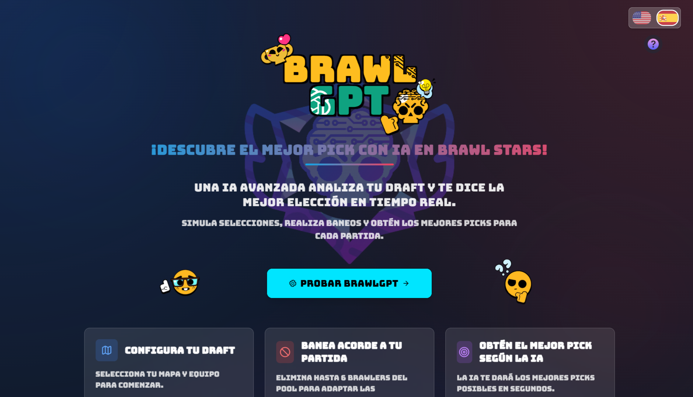
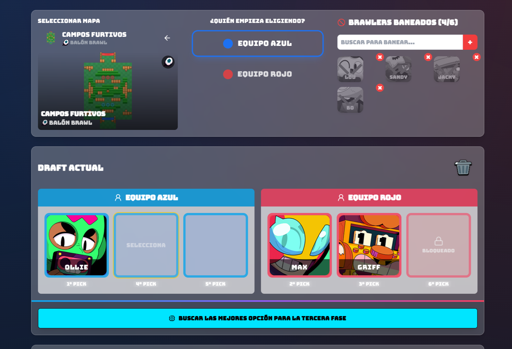
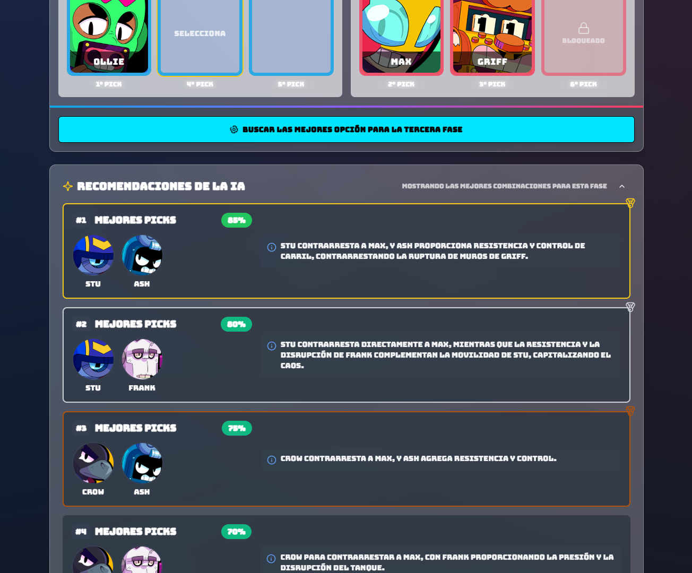
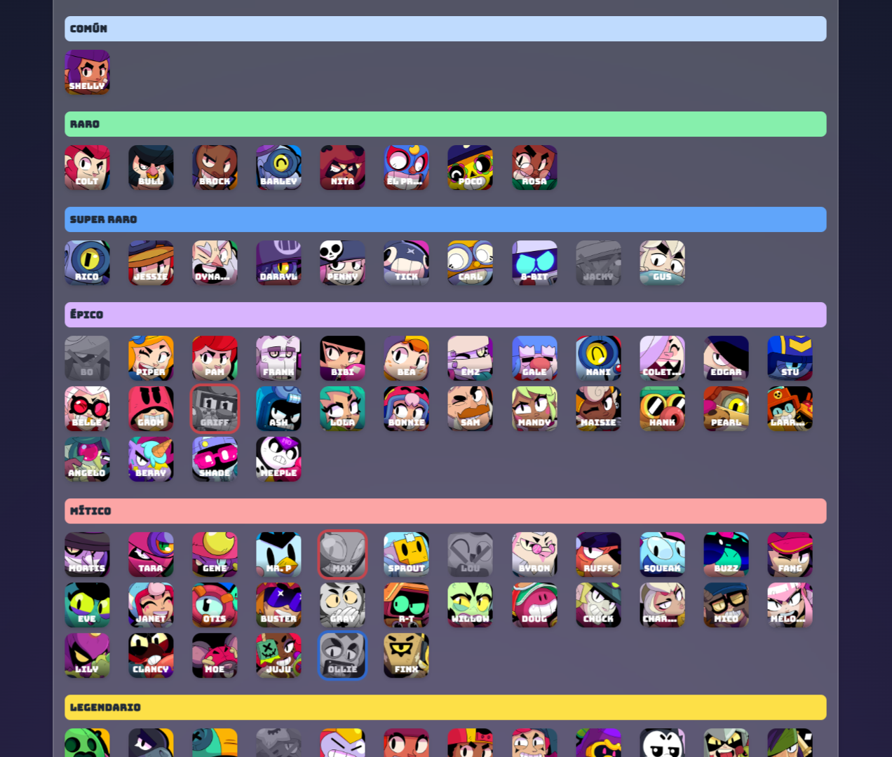

#  BrawlGPT App - Asistente IA para drafts de Brawl Stars competitivo

<div align="center">
  
</div>

BrawlGPT es una app para Brawl Stars que utiliza inteligencia artificial para recomendar la mejor elección de personaje durante el draft previo a la partida. Con una interfaz intuitiva y recomendaciones generadas por IA, BrawlGPT te permite optimizar tu estrategia en cada fase del draft.

## ✨ Características principales

- 🗺️ Selección de mapas con filtros por modo de juego
- 🧠 Recomendaciones de picks inteligentes basadas en el contexto del draft
- 🚫 Sistema de bans para personajes
- 🔄 Simulación completa de drafts con turnos
- 🌐 Soporte multilenguaje (Español e Inglés)
- 🔮 Inteligencia artificial que recomienda los mejores picks en cada fase

---

## 🔗 **Prueba la aplicación en línea**

La app está desplegada públicamente en **Render** usando un plan gratuito, por lo que **puede tardar unos segundos en cargarse** si ha estado inactiva.
Además, la aplicación se conecta con una **API externa también desplegada en Render sin plan de pago** desarrolada por mí, por lo que **al solicitar una recomendación con IA, es posible que la primera respuesta tarde unos segundos en llegar**. Más abajo explico donde encontrar esta API.

Puedes acceder directamente desde el siguiente enlace:

<div align="center">

<a href="https://brawlgpt-app.onrender.com" target="_blank">
  
</a>

</div>

---

## 🖼️ Vista previa de la aplicación

|  |  |
|:--:|:--:|
| **Página de inicio de BrawlGPT** | **Visualización del draft en progreso** |

|  |  |
|:--:|:--:|
| **Recomendaciones de IA en tiempo real** | **Menú de selección de brawlers** |

## 🛠️ Tecnologías utilizadas

- **React** - Framework de UI
- **TypeScript** - Tipado estático
- **Tailwind CSS** - Framework de estilos
- **shadcn/ui** - Componentes de UI
- **i18next** - Internacionalización
- **React DnD** - Drag and Drop de brawlers
- **Vite** - Build tool

## 🧠 Conexión con BrawlGPT API

Este proyecto se conecta con BrawlGPT API, un servicio desarrollado por mí que:

1. Recibe información del estado actual del draft (mapa, brawlers seleccionados, brawlers baneados)
2. Utiliza Google Gemini para analizar la situación y generar recomendaciones contextuales
3. Devuelve las mejores opciones con explicaciones detalladas

La API está construida con FastAPI y utiliza modelos de IA para proporcionar recomendaciones precisas en diferentes fases del draft:

- **Fase 1**: Recomienda el primer brawler para elegir
- **Fase 2**: Sugiere la mejor combinación de dos brawlers
- **Fase 3**: Recomienda picks para completar la estrategia
- **Fase 4**: Sugiere el brawler final para cerrar la composición

Puedes econtrarla en este repositorio:

[](https://github.com/victordiez02/BrawlGPT-API.git)

## 🚀 ¿Cómo funciona?

1. **Selecciona un mapa** - Escoge el mapa donde se jugará la partida
2. **Configura el draft** - Decide qué equipo tiene el primer pick
3. **Banea brawlers** - Excluye personajes que no quieres que aparezcan
4. **Recibe recomendaciones de IA** - En cada fase del draft, recibe sugerencias inteligentes
5. **Completa tu draft** - Selecciona los brawlers finales para tu equipo

## 💻 Instalación local

Para ejecutar BrawlGPT App en tu máquina local:

```bash
# Clona este repositorio
git clone https://github.com/victordiez02/brawl-draft-magic.git

# Navega al directorio del proyecto
cd BrawlGPT

# Instala las dependencias
npm install

# Crea un archivo .env con tu clave de API
echo "VITE_BRAWLGPT_API_KEY=tu_clave_api" > .env

# Inicia el servidor de desarrollo
npm run dev
```

> 🔑 **Nota:** Necesitarás una clave API de BrawlGPT. Puedes obtenerla configurando tu propia instancia de [BrawlGPT API](https://github.com/victordiez02/BrawlGPT-API.git).

## 🤔 ¿Cómo obtener la clave API?

1. Clona y configura el repositorio [BrawlGPT API](https://github.com/victordiez02/BrawlGPT-API.git)
2. Sigue las instrucciones en ese repositorio para generar tu clave API
3. Agrega la clave a tu archivo .env como se muestra arriba

## 🌐 Despliegue

El proyecto está optimizado para ser desplegado en plataformas como Vercel, Netlify o GitHub Pages.

## 📚 Estructura del proyecto

```
BrawlGPT/
├── src/
│   ├── components/     # Componentes React
│   ├── lib/            # Utilidades y datos
│   ├── pages/          # Páginas principales
│   └── i18n.ts         # Configuración de internacionalización
├── public/             # Recursos estáticos
└── README.md           # Documentación
```

## 🔮 Próximas mejoras

- Historial de drafts con estadísticas
- Más idiomas disponibles
- Modo oscuro/claro
- Sincronización con la API oficial de Brawl Stars

## 🤝 Contribuciones

Las contribuciones son bienvenidas. Por favor, abre un issue o un pull request para sugerencias.

## 📄 Licencia

Este proyecto está bajo la licencia MIT.

---

Desarrollado **Víctor Díez**

<div align="center">
  <p><strong>⚠️ Aviso importante</strong></p>
  <p>Este proyecto no está afiliado, respaldado ni patrocinado por Supercell.</p>
  <p>Brawl Stars y sus activos son propiedad de Supercell.</p>
  <p>Para más información, consulta la <a href="https://supercell.com/en/fan-content-policy/">Política de Contenidos de Supercell</a>.</p>
</div>
